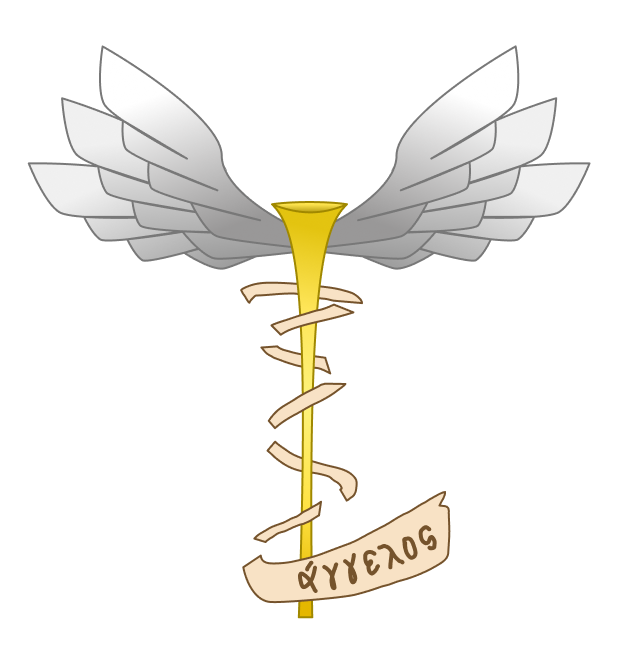

<p align="center">
	
</p>

<br />

# `aggelos` | Small Full Stack Monorepo

> [!NOTE]\
> This application is intended to represet a **message manager**,
> where the author and his/her message are listed. When submitting,
> everyone will have access to your message!

## How to run?

As a first step, install the project dependencies:

```bash
# in project root
npm i
```

Then, copy the contents of '.env.example' to a '.env' file.

```bash
# in 'apps/web' and 'packages/db-schema'
cp .env.example .env
```

Finally, apply the database schema in its local version:

```bash
# in 'apps/functions'
npx wrangler d1 execute aggelos-db --local --file=../../packages/db-schema/schema.sql
```

> [!WARNING]\
> The above solution is temporary, until an abstraction is adopted!
